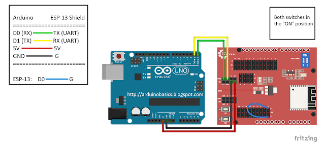

# First Time Setup

First of all, before you begin working on the Arduino I highly recommend you complete one of the basic Sketches just to wrap your head around some Arduino concepts. One of the LED on/off ones would be good!

See [this doc](https://arduinobasics.blogspot.com/2018/09/getting-started-with-keyes-esp-13-wifi.html) for the best setup I could find. The general process is also described here.

## Parts
* Arduino Uno
* ESP-13 Shield
* USB Cable
* 4 Male to Male connectors

## Uno First Time Setup
1. Install the [Arduino IDE](https://www.arduino.cc/en/Main/Software).
2. Connect the Uno via USB.
3. In the IDE, select **TOOLS > BOARD > Arduino Uno/Genuino Uno**.
4. In the IDE, select **TOOLS > PORT > The Arduino** (this will be likely be unique to your device). 
5. Flash the Uno with a blank sketch, select **FILE > EXAMPLES > 01. Basics > Bare Minimum**. This will open a blank sketch.
6. Select **SKETCH > UPLOAD**.
7. After successful upload, disconnect the Uno from the computer.

## IDE Setup
1. Select **FILE > PREFERENCES**.
2. Paste http://arduino.esp8266.com/stable/package_esp8266com_index.json into the "Additional Boards Managers URLs" text box and click "Ok". This adds the ESP8266 repository for use in the next steps..
3. Select **TOOLS > BOARD: "XXX" > Boards Manager**.
4. Search for ESP8266.
5. Select "**esp8266** by **ESP8266 Community** and click install.
6. Once installed, click "Close".

You should now see a much longer list of boards in the **TOOLS > BOARD: "XXX"** list, including ESP-13 Shield (the exact name may vary but there should be only one ESP-13 option).

## ESP-13 Flash Settings
These should be set correctly by default, but just in case (these are visible in the root **TOOLS** dropdown):
* Board: "ESPDuino (ESP-13 Module)"
* Flash Size: "4M (1M SPIFFS)"
* Debug port: "Disabled"
* Debug Level: "None"
* IwIP Variant: "v2 Lower Memory"
* Reset Method: "ESPduino-V2"
* VTables: "Flash"
* CPU Frequency: "80MHz"
* Upload Speed: "115200"
* Erase Flash: Only Sketch
* Port: - (we will select that later)

## Wire Setup
.

1. Make sure that the Arduino UNO is OFF (i.e. not connected to power or USB port)
2. Place the ESP-13 WiFi shield NEXT TO the Arduino UNO
3. Connect a Red wire between 5V on Arduino UNO, and 5V (Arduino side) of the ESP-13 shield
4. Connect a Black wire between GND on Arduino, and G (Arduino side) of the ESP-13 shield
5. Connect a Green wire between D0(RX) on Arduino, and TX (UART - Arduino side) of ESP-13
6. Connect a Yellow wire between D1(TX) on Arduino, and RX (UART - Arduino side) of ESP-13
7. Make sure that both of the switches on the ESP-13 WiFi Shield are in the "ON" position.

## Serial Monitor Setup
1. Plug the USB cable into the computer, and the other end into the Arduino
2. You should see a Red LED ignite on the ESP-13 Shield.
3. In your Arduino IDE, make sure the correct COM port is selected:
4. Tools > Port > COM4 (Arduino/Genuino UNO) - your port may be different. The IDE recognises that an Arduino is using that COM port, even though ESP-13 Board selected
5. Open the Serial Monitor: Tools > Serial Monitor (or Ctrl + Shift + M)
6. Select: Both NL & CR from the drop-down box at the bottom right side of the Serial Monitor.
7. Select: 115200 baud from the other drop-down box in the Serial Monitor window.
8. Press the RESET (RST) button on the bottom left of the ESP-13 WiFi Shield.
9. You may see some garbled information come through, but you should see "Ai-Thinker Technology Co.,Ltd" and "ready" messages in the debug window. As long as you see "ready" everything is all good.

You are now good to go flashing code to the ESP-13!