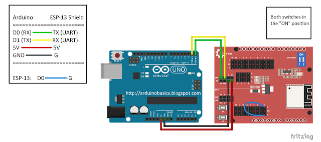

# Arduino Fan Remote
This code will provide a simple webpage with buttons that will allow the user to control RF devices remotely. The webpage can of course be accessed from any device with a browser. 

## Architecture
This code has originally been written for use on an Arduino Uno, with an attached ESP-13 Wifi Shield (Jaycar XC4614, which uses an ESP8266 chip), and a generic 433MHz RF transmitter, in this case Jaycar ZW3100. The code itself is deployed to the ESP-13 Shield, because the Wifi module ([ESP8266Wifi](https://github.com/esp8266/Arduino)) that this was based on used the chip directly. The Uno itself is flashed with a blank program. [WifiESP](https://github.com/bportaluri/WiFiEsp) can be used on the Uno to interface with the Shield. The RF transmitter is therefore connected to the Shield, and is interfaced with by [RCSwitch](https://github.com/sui77/rc-switch). 

The shield maintains an internal "state" which consists of two variables:
  * The state of the TV fan switch.
  * The state of the Lounge fan switch.

The state is the signal that has *most recently* been sent to the fan receiver, i.e. the intended current state of the fan itself (Note there is no guarantee that this is *actually* the state of the fan/s, but as far as the remote is concerned it is). It is simply a combination of LIGHT on/off, and FAN 0/1/2/3. The possible states for each fan, and the associated RF transmission for each can be viewed below, or in more detail in Fan RF Signals.csv. 

The number in each cell is a decimal number representation of the RF signal to be transmitted.

| **Lounge**    | **Light Off** | **Light On** |
|---------------|---------------|--------------|
| **Fan 0**     | 245775        | 245891       |
| **Fan 1**     | 245858        | 245990       |
| **Fan 2**     | 245825        | 245957       |
| **Fan 3**     | 245792        | 245924       |

| **TV**    | **Light Off** | **Light On** |
|-----------|---------------|--------------|
| **Fan 0** | 229389        | 229505       |
| **Fan 1** | 229472        | 229604       |
| **Fan 2** | 229455        | 229571       |
| **Fan 3** | 229422        | 229538       |

The control flow for someone accessing the remote is therefore:
1. The client makes a plain GET request to the address assigned to the shield.
2. The shield acts as a server: it parses the request.
3. The server updates its state as required.
4. The server sends one or more of the signals in the above tables to the RF transmitter, which is then transmitted to the fan/s. 
5. The server generates the HTML as a single String.
6. The generated HTML is returned to the client.

## Installation
### First Time Setup
For first-time setup, have a look at the [here](docs/first_time_setup.md).

### Flashing to the Arduino
With the code open in the Arduino IDE, plug the Uno into the computer and wire the ESP-13 shield to the Uno like so:


Ensure that the ESP13 shield is selected in the IDE, and that the port is correctly configured.

With this setup, the TX/RX (Tranmission/Reception) of the Uno are overriden by that of the ESP13 shield, and the ESP13 will recieve power. Connecting PIN 0 on the shield to G (ground) will also put the shield in receive mode, i.e. it will be prepared to receive data.

In the Arduino IDE you should open the Serial Monitor: Tools/Serial Monitor or ctrl/cmd + shift + m. This monitor is where Serial.println statements can be found. With the Uno and shield wired up as shown above, you should be able to click "upload" (ctrl/cmd + u) to flash your program to the shield. (Note that uploading with nothing plugged in to the Uno's RX/TX ports will allow you to upload to the Uno itself, but **to upload to the ESP13 shield the Uno should be flashed with a blank sketch**).

The Arduino IDE output should output some info on the compiled program's size in bytes, before outputting an "Uploading" progress bar. If you get an error like 
```
error: espcomm_upload_mem failed
```
then:
  * Confirm that the shield and Uno are wired up correctly.
  * Press the "RST" (Reset) button on the shield.
  * Disconnect the Uno from the computer.
  * Hard close and reopen the Arduino IDE.
  * Plug the Uno back in.
  * Try again!

I know the that the above process is kind of nuts, but in my experience it is super consistent. You may also be able to simply hit RST and be good to go.

Once you've successfully uploaded a program, remove the wire connecting D0 to G, and power cycle the shield (remove and replace either the wire connecting to G or to 5V). Reopen the serial monitor and press RST on the shield to see expected output.

## TODO:
  * Tidy up some of the duplicate code, including adding some helper methods for retrieving the current state of the light/fan.

## Futher Reading/Help
ESP13 shield first time setup: https://arduinobasics.blogspot.com/2018/09/getting-started-with-keyes-esp-13-wifi.html

Flashing the shield with a program you can use: https://arduinobasics.blogspot.com/2018/09/esp-13-wifi-shield-web-server.html